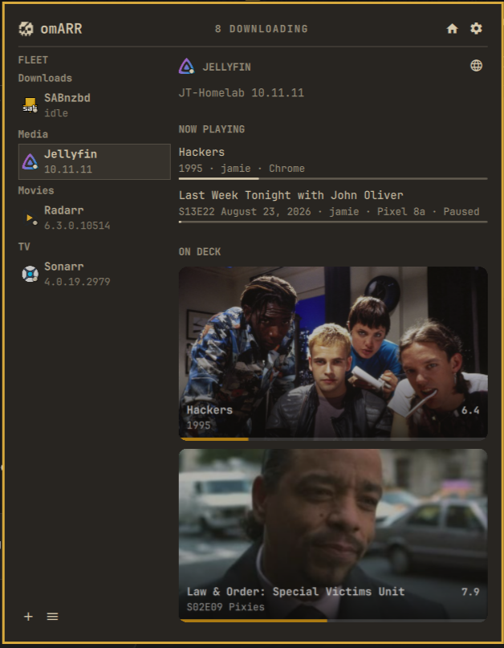

# Jellyfin support

omARR can show Jellyfin health, active sessions, resumable items, recent library items, and artwork.

## Requirements

Jellyfin support requires these items:

- A Jellyfin server that the Omarchy system can access
- An API key from **Dashboard → API Keys**
- An optional profile name for resumable items.

## Add a Jellyfin service

1. Open the omARR settings.
2. Select **Add service**.
3. Select **Jellyfin** as the service kind.
4. Enter the Jellyfin server URL, including its port.
5. Enter the Jellyfin API key.
6. If the server has multiple profiles, enter the profile name that omARR must use.
7. Save the service.

If the profile name is blank, omARR uses the first enabled profile.

## Data

omARR gets Jellyfin data from these API endpoints:

| Data | Endpoint |
| --- | --- |
| Server health and version | `/System/Info` |
| Active sessions | `/Sessions` |
| Resumable items | `/UserItems/Resume` |
| Recent library items | `/Items/Latest` |
| Artwork | `/Items/{itemId}/Images/{imageType}` |

Resumable items use the selected profile. Active sessions include the user, device, playback state, and progress.

omARR prefers landscape backdrops and episode stills. If landscape artwork is not available, omARR uses a series poster.

## Credentials

omARR stores the API key and profile name in `~/.local/state/omarchy/omarr/credentials.json`. This file uses `0600` permissions.

## Test evidence

The integration test used Jellyfin 10.11.11 on an Omarchy system. The test included active sessions, resumable items, recent items, and artwork.

